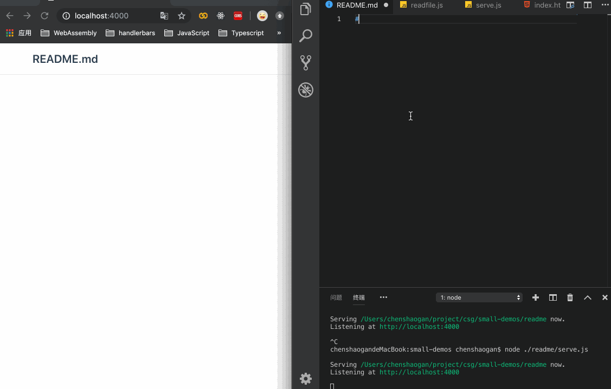

#### 效果图


在编写readme过程中 只要保存修改 就会及时显示在浏览器中预览，通过热更新的方式。

#### 用法
因为已经发布到npm上面，所以可以通过```npm i dg-mp```或者```yarn add dg-mp```安装
然后在```package.json```中添加scripts
```json
"scripts": {
  "dg-mp": "dg-mp"
}
```
最后在命令行中输入```npm run dg-mp```或者```yarn dg-mp```会自动打开浏览器。
默认监听 4000端口 可以通过 ```npm run dg-mp 4001```修改监听端口

#### 原理
通过检测文件的修改，由EventSource方式通知页面更新dom。

#### 修复bug记录
- v1.0.2：修复windows下读取文件为空的bug 

- v1.0.3：模版文件名称修改，可自定义模版文件放在项目根目录下，模版名称```_dgmp_template.html```(后续版本会继续更新)


### github地址
[md-preview](https://github.com/tccsg/md-preview)